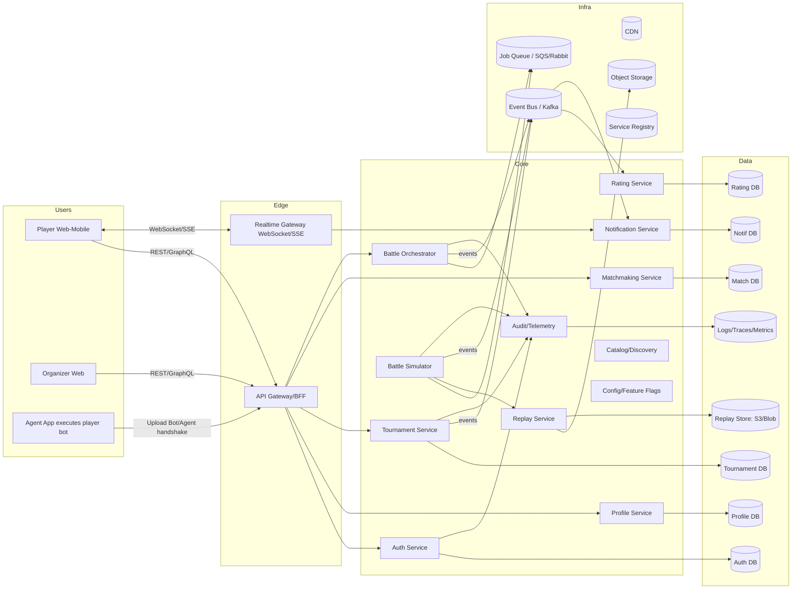
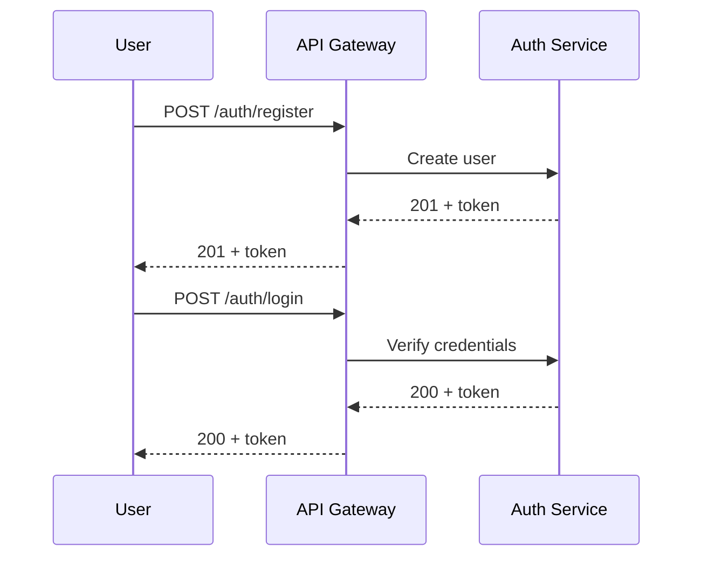
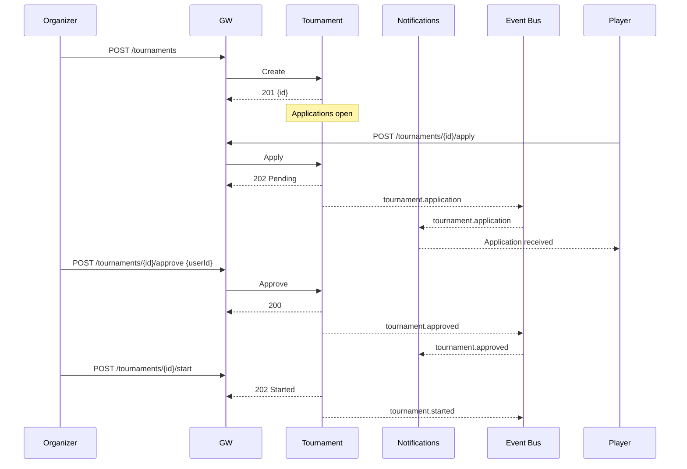
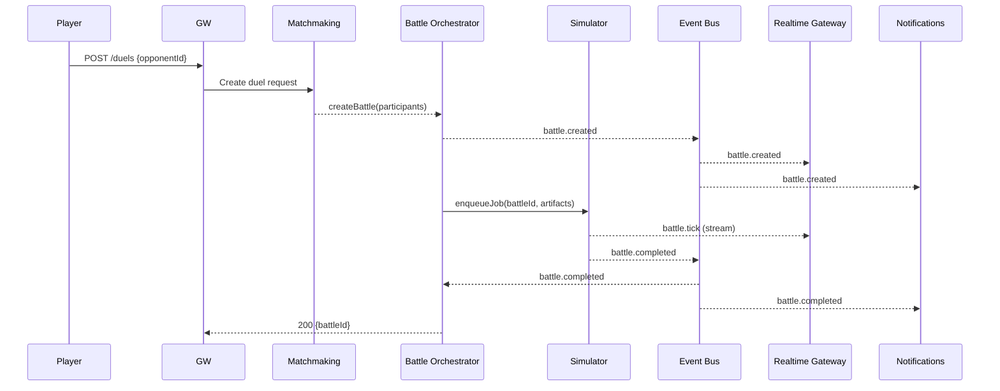
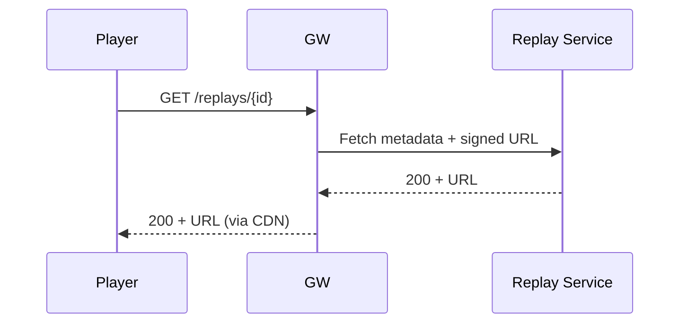

# Space Battle Game - Microservices Architecture

This document presents a microservices architecture for the Space Battle game. It covers service boundaries, message flows, endpoints, scalability considerations, OCP-friendly extensibility points, and explanatory notes.

## 1. High-Level Context

## 2. Microservices and Responsibilities

- Auth Service
  - User registration, login (OAuth2/OIDC), service-to-service tokens.
- Profile Service
  - User profiles, preferences, agent metadata, bot binaries' metadata.
- Agent Upload/Registry (part of Profile or separate Catalog/Discovery)
  - Stores bot binaries, validates interfaces, tracks versions.
- Tournament Service (TMS)
  - CRUD tournaments, applications, brackets, scheduling, results lifecycle.
- Matchmaking Service (MM)
  - Ad-hoc duels, queues, rating-based pairing.
- Battle Orchestrator (BTL)
  - Creates battle jobs, allocates simulator capacity, coordinates lifecycle.
- Battle Simulator (SIM)
  - Executes deterministic simulations with given agents/bots, produces events and a replay.
- Replay Service (REP)
  - Stores and serves replays and match telemetry; CDN integration.
- Rating Service (RAT)
  - Computes players’ rating deltas post-battle and aggregates tournament ratings.
- Notification Service (NOTIF)
  - Multi-channel notifications (email, push, WS), in-app feeds.
- Realtime Gateway (WS)
  - Delivers live battle updates, notifications via WebSocket/SSE.
- API Gateway / BFF (GW)
  - Single entry point, request routing, composition, auth, rate-limiting.
- Observability (AUD)
  - Centralized logs, traces, and metrics.
- Config/Feature Flags (CFG)
  - Runtime toggles for experiments and throttles.

## 3. Endpoints and Message Contracts (selected)

Conventions:
- REST paths are indicative; gRPC equivalents may be used.
- Async topics are Kafka-style.

Auth Service
- POST /auth/register
- POST /auth/login
- GET /auth/me

Profile Service
- GET /profiles/{userId}
- PATCH /profiles/{userId}
- POST /agents: upload/register bot binary (multipart or signed URL)
- GET /agents/{agentId}

Tournament Service
- GET /tournaments?status=upcoming|live|finished
- POST /tournaments (organizer)
- POST /tournaments/{id}/apply
- POST /tournaments/{id}/approve {userId}
- POST /tournaments/{id}/start
- GET /tournaments/{id}/bracket

Matchmaking Service
- POST /matchmaking/enqueue {mode, ratingRange}
- DELETE /matchmaking/enqueue
- POST /duels {opponentId}

Battle Orchestrator
- POST /battles {participants, mapId, ruleset}
- GET /battles/{id}
- Events:
  - topic: battle.created {battleId, participants, ruleset}
  - topic: battle.completed {battleId, winnerId, duration, replayId}

Battle Simulator
- Job Queue payload: {battleId, agentArtifacts, seed, map, ruleset}
- Emits events:
  - topic: battle.tick {battleId, t, stateDelta}
  - topic: battle.completed {battleId, winnerId, telemetry, replayId}

Replay Service
- GET /replays/{replayId}
- GET /replays/{replayId}/download

Rating Service
- Consumes: battle.completed
- POST /ratings/recompute (admin)
- GET /ratings/{userId}
- GET /tournaments/{id}/rating

Notification Service
- Consumes: tournament.application, tournament.approved, battle.created, battle.startingSoon, battle.completed
- WebSocket channels via Realtime Gateway: /ws/notifications
- REST: GET /notifications (with pagination, read/unread)

Realtime Gateway
- /ws/live/{battleId}: live updates (from battle.tick stream)

Observability
- Receives traces/metrics/logs via OTLP.

## 4. Key Flows (Sequence Diagrams)

### 4.1 Registration & Auth

### 4.2 Tournament Lifecycle

### 4.3 Matchmaking Duel

### 4.4 Replay View

## 5. Scaling Bottlenecks & Mitigations

1) Battle Simulation CPU/GPU hot spot
- Problem: SIM is compute-heavy; spikes during tournaments.
- Mitigations:
  - Job queue with autoscaling workers; bin-pack by resources.
  - Priority queues (tournament > casual).
  - Deterministic sandboxing; pre-warm containers/VMs; node affinity.
  - Horizontal sharding by region; cap concurrency per user.

2) Realtime event fan-out (battle.tick)
- Problem: Many spectators produce N×M fan-out.
- Mitigations:
  - Use broker with compaction/batching; WS gateway with backpressure.
  - Send deltas at adaptive rates; drop frames for slow clients; snapshot every N ticks.
  - Use CDN/edge WS where supported.

3) Notification throughput and multi-channel latency
- Problem: Different SLAs across push/email/WebSocket.
- Mitigations:
  - Outbox pattern per service; dedicated workers per channel.
  - Rate-limit and per-user digesting; idempotent keys.

4) Tournament scheduling contention
- Problem: Cron-like triggers cause thundering herd.
- Mitigations:
  - Distributed scheduler with jitter; partitioned locks; leader election.
  - Pre-generate brackets; stagger match start times.

5) Hot partitions in ratings/leaderboards
- Problem: Writes focused on top players/tournaments.
- Mitigations:
  - Sharded counters; write-behind caching; CQRS separation.
  - Precomputed views with materialized projections.

6) Storage for replays
- Problem: Large binaries; expensive egress.
- Mitigations:
  - Object storage with lifecycle tiers; gzip/delta encoding; CDN.
  - Deduplicate identical assets; chunked uploads; signed URLs.

7) API Gateway pressure
- Problem: Burst traffic during events.
- Mitigations:
  - Circuit breakers, token bucket rate limiting, autoscaling, caching.
  - Separate read vs write paths; GraphQL persisted queries.

## 6. Components Likely to Change & OCP Strategies

- Ruleset/Physics Engine
  - Changes: new weapons, maps, physics tweaks.
  - OCP: Strategy pattern for ruleset; SIM loads rules via plugin interface; versioned contracts.

- Matchmaking Algorithms
  - Changes: ELO vs Glicko, party sizes, constraints.
  - OCP: Strategy/provider registry; MM selects algorithm by mode without modifying callers.

- Notification Channels
  - Changes: add SMS, Discord, in-app inbox formats.
  - OCP: Channel interface + dispatcher; new channels implement interface; config-driven routing.

- Tournament Formats
  - Changes: Swiss, single/double elimination, round-robin.
  - OCP: Bracket engine interface; TMS composes format provider.

- Rating Calculation
  - Changes: per-tournament weighting, decay, team ratings.
  - OCP: Pluggable rating calculators; event-driven projections; feature flags for rollout.

- Anti-Cheat & Validation
  - Changes: new heuristics, sandboxing policies.
  - OCP: Chain-of-responsibility validators before SIM run; independent deployable service.

- Agent/Bot Interface
  - Changes: protocol versions, time limits, resource limits.
  - OCP: Capability negotiation; versioned IPC; adapter layer per version.

## 7. Textual Explanation

- Users must be registered to participate; Auth and Profile manage identity.
- Tournaments can be created by any user; TMS manages lifecycle, applications, brackets, and emits events consumed by Notifications and Orchestrator.
- Players can duel on-demand via Matchmaking; the Orchestrator creates battle jobs and feeds the Simulator.
- Simulator produces live ticks for spectators through the Realtime Gateway and also writes a replay to the Replay Service.
- Upon completion, events update Ratings, drive Notifications, and finalize tournament results.
- Object storage and CDN handle large replay assets; event bus decouples services for resilience and scalability.

## 8. Deliverables Checklist vs Criteria

- Diagrams describing microservices and message flows: provided (context + sequences).
- Endpoints and message directions per service: provided.
- Bottlenecks and scaling issues with solutions: multiple identified with mitigations.
- Components with frequently changing requirements and OCP approaches: multiple listed.
- Textual explanation covering the whole system: provided.

## 9. Notes on Implementation

- Prefer gRPC/Protobuf for internal service-to-service APIs; REST/GraphQL for external.
- Use OpenTelemetry for tracing; propagate context through MQ and job queue.
- Apply the Outbox pattern and Idempotency keys for reliability across events.
- Enforce zero-trust between services (mTLS, per-service authz).
